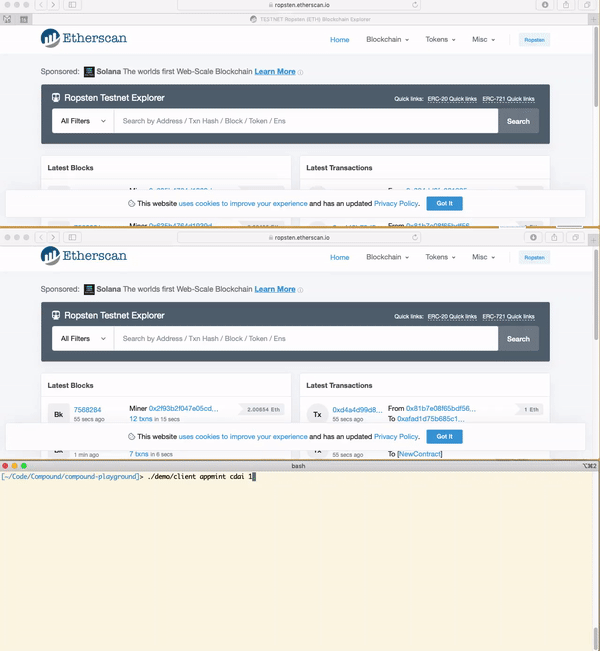

# Compound Playground
This demo app demonstrates basic interaction with the [compound](https://compound.finance) smart contracts system for supplying liquidity and borrowing funds.

This also demonstrates how to send multiple Ethereum transaction, without having to wait for each transaction to complete, a way to mitigate the baDAPProve security issue.

## The baDAPProve issue
DeFi contracts actions such as lending typically require the pre-approval of a user to be able to transfer ERC20 tokens on his behalf.
This approval is done by calling the `approve` function of ERC20, where a sender permits a different address (i.e. spender, in this case the DeFi contract) to spend a given amount on his behalf.
This is usually a mandatory prerequisite before a user can continue to some core action as part of the interaction with the DeFi app. 
This repository demonstrates how to execute these two transactions with minimal trade-offs between latency and security.

### The security issue
This simple solution is to simply perform a single approve of a nearly infinite amount.
The clear drawback of this solution it allows the contract to withdraw more than the user intended due to a bug, vulnerability etc.

### The parallelization issue
Sending both transactions (approve, action) in parallel can save time. However, when `estimateGas` function is called on the action Tx, it will not be updated with the results of the user approve, the function simulation will probably fail. 
This might result in a wrong GasLimit estimation of the action transaction. 
Consequently, the action Tx will fail upon broadcast.

### Fee estimation algorithm 
1. Estimate gas based on historical data and set it as __Gas_Limit__
2. Take a margin of __L__>1 and set __Limit_used__ = __Gas_Limit__ * __L__
3. For each executed transaction(With __Limit_Used__), read the actual gas used: __Gas_used__
4. If __Gas_used__ > __Gas_Limit__, set __Gas_Limit__ = __Gas_used__, __Limit_used__ = __Gas_used__ * __L__
5. If a transaction fails for insufficient gas:
    * Run `estimateGas()` on the failed transaction and obtain __Failed_Limit__    
    * Create and sign a new transaction
    * Retransmit transaction with new estimation
    * Update __Gas_Limit__ = __Failed_Limit__
    * Raise error for investigation


## Usage
### Building from source
```sh
yarn install
yarn run build
./demo/client <option>
```

### Options to use on client:
* `balance <token>`  
Get your balance in cToken or underlying Token
Example
`./demo/client dai`
`./demo/client cdai`


* `appmint <cToken> <amount>`  
This operation demonstrates the discussed technique above. GasLimit for the approve and mint transactions is read from the database. Both transactions are created and signed with nonce=`n` and nonce=`n+1` respectively.  
Both transactions are then broadcaster to the network _asyncronously_.   
Example, to supply 100 DAI to compound:  
`./demo/client appmint cdai 100`

* `approve <cToken> <amount>`  
Supply the passed amount to compound cToken contract. Amount is specified in underlying token.
Example, to supply 100 DAI to compound:  
`./demo/client mint cdai 100`

* `mint <cToken> <amount>`  
Supply the passed amount to compound cToken contract. Amount is specified in underlying token.
Example, to supply 100 DAI to compound:  
`./demo/client mint cdai 100`

* `redeem <cToken> <amount>`  
Redeem an amount corresponding to the underlying token.
Example, to redeem 50 DAI from compound:  
`./demo/client redeem cdai 50`


### Demo Gif
Recording of the `appmint` in action, sending two Txs asynchronously  

